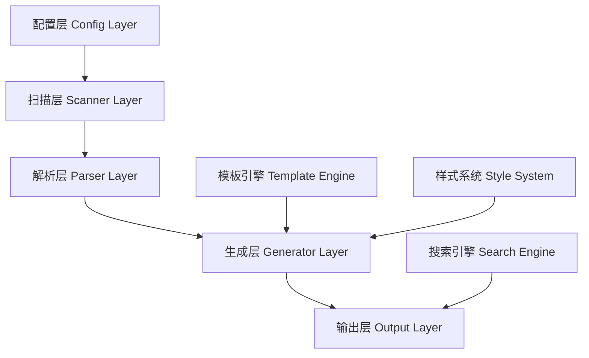
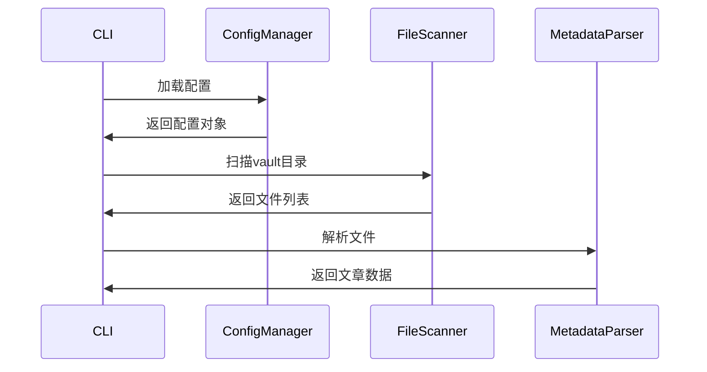
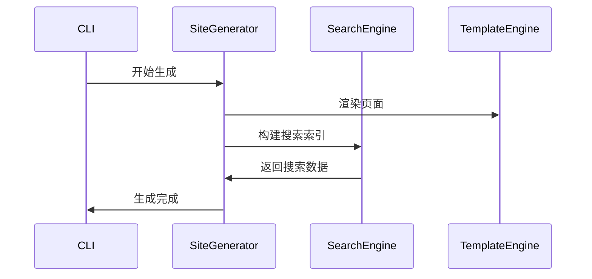

# 设计文档

## 概述

Obsidian博客生成器是一个基于Node.js的静态网站生成工具，它将Obsidian笔记库转换为简约大气的个人博客网站。系统采用模块化架构，包含配置管理、文件扫描、元数据解析、HTML生成和搜索功能等核心组件。

## 架构

系统采用分层架构设计，确保各组件职责清晰、松耦合：



### 核心组件关系

- **配置层**: 管理用户配置和系统设置
- **扫描层**: 遍历Obsidian vault，发现markdown文件
- **解析层**: 提取frontmatter和内容，构建文章数据结构
- **生成层**: 将数据转换为HTML页面
- **输出层**: 生成最终的静态网站文件

## 组件和接口

### 1. 配置管理器 (ConfigManager)

**职责**: 处理配置文件的读取、验证和默认值设置

```typescript
interface BlogConfig {
  vaultPath: string;
  outputPath: string;
  siteTitle: string;
  siteDescription: string;
  author: string;
  theme: 'light' | 'dark' | 'auto';
  postsPerPage: number;
}

class ConfigManager {
  loadConfig(configPath?: string): BlogConfig
  validateConfig(config: BlogConfig): ValidationResult
  createDefaultConfig(): BlogConfig
}
```

### 2. 文件扫描器 (FileScanner)

**职责**: 递归扫描vault目录，识别markdown文件

```typescript
interface ScanResult {
  files: string[];
  errors: ScanError[];
  totalSize: number;
}

class FileScanner {
  scanVault(vaultPath: string): Promise<ScanResult>
  isMarkdownFile(filePath: string): boolean
  getFileStats(filePath: string): FileStats
}
```

### 3. 元数据解析器 (MetadataParser)

**职责**: 解析YAML frontmatter和markdown内容

```typescript
interface ArticleMetadata {
  title: string;
  date: Date;
  tags: string[];
  description?: string;
  draft?: boolean;
  slug?: string;
}

interface ParsedArticle {
  metadata: ArticleMetadata;
  content: string;
  filePath: string;
  wordCount: number;
}

class MetadataParser {
  parseFile(filePath: string): Promise<ParsedArticle>
  extractFrontmatter(content: string): ArticleMetadata
  processMarkdown(content: string): string
}
```

### 4. 网站生成器 (SiteGenerator)

**职责**: 生成HTML页面和静态资源

```typescript
interface GenerationOptions {
  config: BlogConfig;
  articles: ParsedArticle[];
  outputPath: string;
}

class SiteGenerator {
  generateSite(options: GenerationOptions): Promise<void>
  generateHomePage(articles: ParsedArticle[]): string
  generateArticleList(articles: ParsedArticle[]): string
  generateArticlePage(article: ParsedArticle): string
  copyStaticAssets(): Promise<void>
}
```

### 5. 搜索引擎 (SearchEngine)

**职责**: 构建搜索索引和提供搜索功能

```typescript
interface SearchIndex {
  articles: SearchableArticle[];
  index: Map<string, number[]>;
}

interface SearchResult {
  article: ParsedArticle;
  score: number;
  highlights: string[];
}

class SearchEngine {
  buildIndex(articles: ParsedArticle[]): SearchIndex
  search(query: string, index: SearchIndex): SearchResult[]
  generateSearchData(): string
}
```

## 数据模型

### 文章数据结构

```typescript
interface Article {
  id: string;
  title: string;
  slug: string;
  date: Date;
  tags: string[];
  description: string;
  content: string;
  htmlContent: string;
  wordCount: number;
  readingTime: number;
  filePath: string;
  isDraft: boolean;
}
```

### 网站数据结构

```typescript
interface SiteData {
  config: BlogConfig;
  articles: Article[];
  tags: TagInfo[];
  recentArticles: Article[];
  totalArticles: number;
  lastUpdated: Date;
}

interface TagInfo {
  name: string;
  count: number;
  articles: Article[];
}
```

## 模板系统

使用简单的模板引擎处理HTML模板：

### 页面模板

1. **布局模板** (`layout.html`): 基础页面结构
2. **首页模板** (`index.html`): 首页布局
3. **文章列表模板** (`articles.html`): 文章列表页
4. **文章详情模板** (`article.html`): 单篇文章页面
5. **搜索页面模板** (`search.html`): 搜索结果页面

### 响应式设计

采用移动优先的响应式设计策略：

```css
/* 移动设备 (默认) */
.container { max-width: 100%; padding: 1rem; }

/* 平板设备 */
@media (min-width: 768px) {
  .container { max-width: 768px; padding: 2rem; }
  .article-grid { grid-template-columns: repeat(2, 1fr); }
}

/* 桌面设备 */
@media (min-width: 1024px) {
  .container { max-width: 1024px; }
  .article-grid { grid-template-columns: repeat(3, 1fr); }
  .sidebar { display: block; }
}
```

## 处理流程

### 1. 初始化流程



### 2. 生成流程



## 错误处理

### 错误分类

1. **配置错误**: 无效的配置文件或路径
2. **文件系统错误**: 权限不足、文件不存在
3. **解析错误**: 无效的YAML frontmatter或markdown语法
4. **生成错误**: 模板渲染失败、输出目录问题

### 错误处理策略

```typescript
interface ErrorHandler {
  handleConfigError(error: ConfigError): void
  handleFileError(error: FileError): void
  handleParseError(error: ParseError): void
  handleGenerationError(error: GenerationError): void
}

class GracefulErrorHandler implements ErrorHandler {
  // 记录错误但继续处理其他文件
  handleParseError(error: ParseError): void {
    console.warn(`解析文件失败: ${error.filePath}, 错误: ${error.message}`);
    // 记录到错误日志但不中断整个流程
  }
}
```

## 正确性属性

*属性是一个特征或行为，应该在系统的所有有效执行中保持为真——本质上是关于系统应该做什么的正式陈述。属性作为人类可读规范和机器可验证正确性保证之间的桥梁。*

### 属性 1: 路径验证一致性
*对于任何* 输入路径，配置验证器应该一致地识别有效路径（存在且可读）和无效路径，并为无效路径提供描述性错误信息
**验证需求: 1.2, 1.3**

### 属性 2: Markdown文件识别完整性
*对于任何* 目录结构，文件扫描器应该识别所有具有.md或.markdown扩展名的文件，不遗漏任何markdown文件
**验证需求: 2.1**

### 属性 3: 元数据提取一致性
*对于任何* 包含有效YAML frontmatter的markdown文件，元数据解析器应该正确提取所有标准字段（title、date、tags），并为缺失字段提供合理默认值
**验证需求: 2.2, 2.4**

### 属性 4: YAML解析往返一致性
*对于任何* 有效的YAML frontmatter，解析后重新序列化应该产生等价的数据结构
**验证需求: 2.3**

### 属性 5: 文章索引完整性
*对于任何* 文章集合，生成的索引应该包含所有文章的完整元数据，且索引中的文章数量等于输入文章数量
**验证需求: 2.5**

### 属性 6: HTML生成结构完整性
*对于任何* 文章数据，生成的HTML页面应该包含所有必需的结构元素（标题、内容、导航、元数据）
**验证需求: 3.1, 3.2**

### 属性 7: 文章排序一致性
*对于任何* 文章集合，文章列表页面应该按照日期降序排列，最新文章排在最前面
**验证需求: 3.3**

### 属性 8: Markdown到HTML转换保真性
*对于任何* 有效的markdown内容，转换为HTML后应该保持原始内容的语义结构和格式
**验证需求: 3.4**

### 属性 9: 内部链接转换正确性
*对于任何* 包含Obsidian内部链接的文章，生成的HTML应该将内部链接转换为正确的相对路径
**验证需求: 3.5**

### 属性 10: 响应式布局适应性
*对于任何* 屏幕尺寸，生成的CSS应该应用适当的布局规则（桌面多列、平板两列、手机单列）
**验证需求: 4.1, 4.2, 4.3, 4.4**

### 属性 11: 触摸友好性
*对于任何* 交互元素，在触摸设备上应该具有足够的尺寸（最小44px）和适当的间距
**验证需求: 4.5**

### 属性 12: 搜索功能完整性
*对于任何* 搜索查询，搜索引擎应该在文章标题和内容中查找匹配项，并返回相关结果
**验证需求: 5.1, 5.2**

### 属性 13: 搜索结果高亮一致性
*对于任何* 搜索结果，匹配的关键词应该在结果中被正确高亮显示
**验证需求: 5.3**

### 属性 14: 搜索导航正确性
*对于任何* 搜索结果项，点击应该导航到对应文章的正确URL
**验证需求: 5.5**

### 属性 15: 错误恢复能力
*对于任何* 损坏或无法读取的文件，系统应该记录错误信息但继续处理其他文件，不中断整个流程
**验证需求: 6.1**

### 属性 16: 错误信息清晰性
*对于任何* 系统错误（权限、存储空间等），错误信息应该清晰描述问题原因和可能的解决方案
**验证需求: 6.2, 6.3**

### 属性 17: 进度报告准确性
*对于任何* 长时间运行的操作，进度信息应该准确反映当前处理状态和完成百分比
**验证需求: 6.4**

### 属性 18: 断点续传一致性
*对于任何* 中断的生成过程，重新启动后应该能够从上次中断的位置继续，避免重复处理
**验证需求: 6.5**

## 测试策略

### 双重测试方法

系统将采用单元测试和基于属性的测试相结合的方法：

- **单元测试**: 验证特定示例、边界情况和错误条件
- **基于属性的测试**: 验证跨所有输入的通用属性
- 两者互补，确保全面覆盖（单元测试捕获具体错误，属性测试验证通用正确性）

### 基于属性的测试配置

- 使用fast-check库进行JavaScript/TypeScript的基于属性测试
- 每个属性测试最少运行100次迭代（由于随机化）
- 每个测试必须引用其设计文档属性
- 标签格式: **Feature: obsidian-blog-generator, Property {number}: {property_text}**
- 每个正确性属性必须由单个基于属性的测试实现

### 单元测试重点

单元测试应专注于：
- 演示正确行为的特定示例
- 组件之间的集成点
- 边界情况和错误条件

### 属性测试重点

属性测试应专注于：
- 适用于所有输入的通用属性
- 通过随机化实现全面的输入覆盖

### 测试覆盖范围

- 配置管理: 路径验证、默认值生成
- 文件扫描: 目录遍历、文件识别
- 元数据解析: YAML解析、默认值处理
- HTML生成: 模板渲染、结构完整性
- 搜索功能: 索引构建、查询处理
- 响应式设计: CSS媒体查询、布局适应
- 错误处理: 异常恢复、错误信息