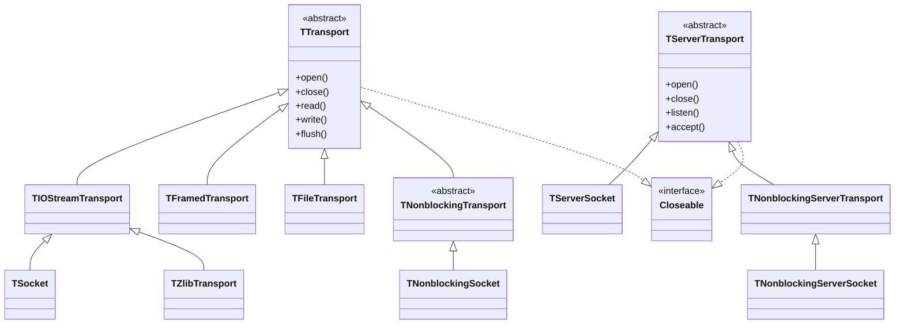
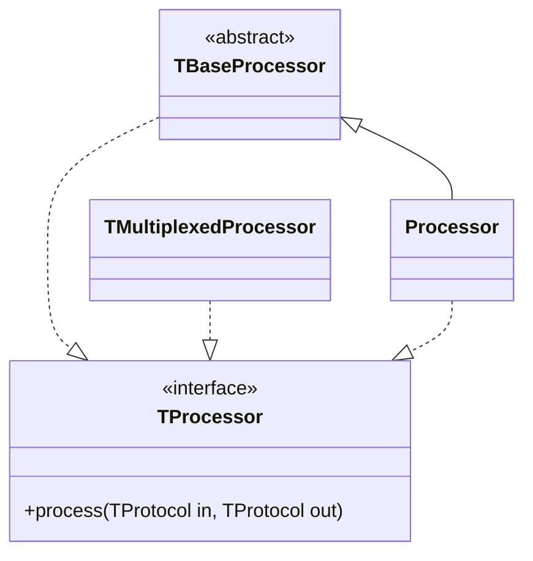
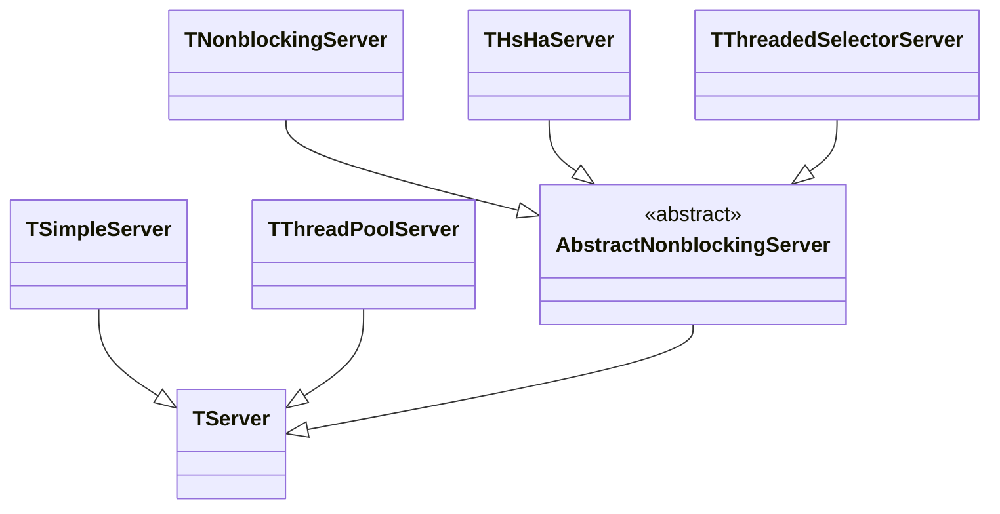

`Thrift`是一种轻量化、语言无关的RPC框架。主要包含三大部分：代码生成、序列化框架、RPC框架。


<!--more-->

# Thrift网络协议栈
`Thrfit`采用的是`C/S`模型，网络协议栈从下到上分别为：`Transport layer`、`Protocol layer`、`Processor layer`、`Server layer`。

```
  +-------------------------------------------+
  | Server                                    |
  | (single-threaded, event-driven etc)       |
  +-------------------------------------------+
  | Processor                                 |
  | (compiler generated)                      |
  +-------------------------------------------+
  | Protocol                                  |
  | (JSON, compact etc)                       |
  +-------------------------------------------+
  | Transport                                 |
  | (raw TCP, HTTP etc)                       |
  +-------------------------------------------+
```

## Transport
`Thrift` 传输层为网络`write/read`提供了一个简单的抽象，定义了具体的网络传输协议。其本质是一个提供了通过各种协议进行通信的框架，支持包括`HTTP`和`TCP`等。这使`Thrift`能够将底层传输与系统的其余部分解耦（例如，序列化/反序列化）。传输层接口暴露的一些方法包括：`open、close、read、write、flush`等

传输层分为`TTransport`（客户端）和`TServerTransport`（服务端）两类，配合装饰器模式，通过节点流和包装流的概念来区分各种`Transport`实现。



### 客户端传输层（TTransport）
 -  `TIOStreamTransport`: 是最常用的基于阻塞式`I/O`模型的传输层实现，通过一个输入流和一个输出流实现了所有的传输操作；完美的兼容Java的各种I/O流操作；是`TSocket`和`TZlibTransport`基类。
 - `TSocket`: 通过`Socket`实现`TTransport`，阻塞式，侧重建立连接；
 - `TZlibTransport`: 基于`InflaterInputStream`和`DeflaterOutputStream(java.util.zip)`实现对输入输出流的压缩，通过调用下一层的`TTransport`实现读写操作，是一个装饰器模式
 - `TNonblockingSocket`: 通过`NIO`包中的`SocketChannel`实现非阻塞传输，服务于异步客户端实现
 - `TFramedTransport`: 利用`NIO`包的`TByteBuffer`读写缓存，以栈帧为传输单位的`TTransport`装饰器实现；帧头部用4个填充字节来存储数据流长度，保障数据的完整性；
 - `TFileTransport`: 用于将数据写入文件，JAVA仅支持read操作，不支持write；

### 服务端传输层（TServerTransport）
- `TServerSocket`: 服务端阻塞式传输层，基于`ServerSocket`实现；
- `TNonblockingServerSocket`：服务端非阻塞式传输层，基于`NIO`的`ServerSocketChannel`实现；

## Protocol
`Protocol`定义了一种将内存数据结构映射为有线格式的机制。换句话说，`protocol`定义了指定数据类型如何使用底层`transport`来编解码。因此，`protocol`实现管理编码方案并负责（反）序列化。常用的`protocol`有`JSON、XML、PLAIN TEXT、COMPACT BINARY`等。
- `TBinaryProtocol`: 二进制编码格式的数据传输协议；
- `TCompactProtocol`: 高效率密集的压缩二进制的数据传输协议；
- `TJSONProtocol`: 使用JSON编码格式传输协议，抓包格式可见；
- `TSimpleJSONProtocol`: 简单的JSON格式数据传输协议；仅支持写入，用于脚本语言输出，一般不使用这种
- `TDebugProtocol`: 使用易懂可读的文本格式进行传输，便于debug调试

`Thrift`中关于`protocol`的接口有：

```cpp
writeMessageBegin(name, type, seq)
writeMessageEnd()
writeStructBegin(name)
writeStructEnd()
writeFieldBegin(name, type, id)
writeFieldEnd()
writeFieldStop()
writeMapBegin(ktype, vtype, size)
writeMapEnd()
writeListBegin(etype, size)
writeListEnd()
writeSetBegin(etype, size)
writeSetEnd()
writeBool(bool)
writeByte(byte)
writeI16(i16)
writeI32(i32)
writeI64(i64)
writeDouble(double)
writeString(string)

name, type, seq = readMessageBegin()
                  readMessageEnd()
name = readStructBegin()
       readStructEnd()
name, type, id = readFieldBegin()
                 readFieldEnd()
k, v, size = readMapBegin()
             readMapEnd()
etype, size = readListBegin()
              readListEnd()
etype, size = readSetBegin()
              readSetEnd()
bool = readBool()
byte = readByte()
i16 = readI16()
i32 = readI32()
i64 = readI64()
double = readDouble()
string = readString()
```

## Processor
`Processor`封装了从`input`读取数据和写入数据到`output`的能力。输入和输出流通过`Protocol`对象表示，`Thrift`通过使用`IDL描述文件`来自动生成`Processor`。`Processor`接口非常简单：

``` java
interface TProcessor {
    bool process(TProtocol in, TProtocol out) throws TException
}
```



```java
//只有在定义Server端的时候用到，客户端不需要关心；示例代码： 
//PlayerServiceImpl是PlayerService.Iface的实现； 
private PlayerServiceImpl playerService = new PlayerServiceImpl(); 
//Server定义
PlayerService.Processor<PlayerService.Iface> processor = new PlayerService.Processor<>(playerService);
TServerTransport transport = new TServerSocket(3041); 
TServer server = new TSimpleServer(newTServer.Args(transport).processor(processor);
System.out.println("Starting the simple server..."); 
server.serve();
```

### TMultiplexedProcessor

上述示例中一个Server只绑定一个Service，实际项目中往往有大量的接口服务，如果把所有接口方法写在一个Service接口文件中，不论是代码的结构优化、可读性还是后续维护都带来很多隐患和不便。 幸好，`Thrift`提供了`TMultiplexedProcessor`和`TMultiplexedProtocol`类来帮助开发者拆分和组装业务接口服务。

服务端使用`TMultiplexedProcessor`类注册多个接口的服务实现类
```java
TMultiplexedProcessor multiplexedProcessor = new TMultiplexedProcessor();
multiplexedProcessor.registerProcessor(ServiceEnum.PLAYER.serviceName, newPlayerService.Processor<PlayerService.Iface>(new PlayerServiceImpl())); multiplexedProcessor.registerProcessor(ServiceEnum.GUILD.serviceName, newGuildService.Processor<GuildService.Iface>(new GuildServiceImpl()));
```

客户端使用`TMultiplexedProtocol`类来创建`Client`实例，帮助区分调用具体的服务接口
```java
TProtocol protocol = new TBinaryProtocol(transport);
PlayerService.Client playerService = new PlayerService.Client(new TMultiplexedProtocol(protocol, ServiceEnum.PLAYER.serviceName));
GuildService.Client playerService = newGuildService.Client( new TMultiplexedProtocol(protocol, ServiceEnum.GUILD.serviceName));
```

## Server
`server`将上面所有的特性整合在一起形成最终的服务：

-   创建`transport`实例，建立连接通道
-   为`transport`创建输入输出协议`protocol`
-   基于输入输出协议创建`processor`
-  等待新建连接并转交给`processor`



### TSimpleServer
- 该模式下只有一个工作线程，接受请求和处理数据都在一个线程中
- 简单的阻塞`I/O`模式，一次只能处理一个请求，多个客户端请求被串行处理

### TThreadPoolServer
-   该模式是对`TSimpleServer`模式的优化，同样是基于阻塞`I/O`实现，每次只能监听一个请求连接
-   采用线程池技术，请求到达后，交给`worker`线程来处理，多线程并行处理了`I/O`的读写。
-   单个请求的处理不会影响服务端整体的性能，但是连接池的规模决定了该模式的工作能力；

### TNonblockingServer
-   该模式同样只有一个工作线程，相较于`TSimpleServer`模式的不同，该模式采用`I/O`多路复用；
-   基于`I/O`多路复用实现，非阻塞`I/O`，使用`selector`可以同时监听多个到达的连接请求；
-   虽然同时监听多个请求，但是请求的处理还是串行，无法充分利用多核优势，且某个请求处理被阻塞会直接影响后续请求的处理
-   该模式下必须使用`TFramedTransport`

### THsHaServer
-  该模式可以理解为对`TNonblockingServer`的优化，基于`I/O`多路复用实现，非阻塞`I/O`，采用`Half-sync/Half-async`的工作模式
-  `Half-aysnc`是在处理`I/O`事件上 (accept/read/write)，`Half-sync`用于`handler` 对`rpc`的同步处理上。
- `THsHaServer` 在完成数据读取之后，将业务处理过程交由一个线程池来完成，主线程直接返回进行下一次循环操作，效率大大提升，但是主线程需要完成所有`socket`的监听以及数据读写，当请求书较大且发送数据量较多，监听的`socket`请求不能被及时处理。
-   该模式必须使用`TFramedTransport`

### TThreadedSelectorServer

`THsHaServer`缺点是主线程仍然需要完成所有`socket`的`listen`和`accept`、数据读取和数据写入操作(read/write)。当并发请求数较大时，且发送数据量较多时，负责监听的主线程就只有一个。监听socket上新连接请求不能被及时接受。 `TThreadedSelectorServer`是对`THsHaServer`的一种扩充与完善，它将`selector`中的读写`I/O`事件从主线程中分离出来。交给了多个专门负责读写`I/O`事件的`SelectorThread`，同时引入`worker`工作线程池，负责业务处理。它也是种`Half-Sync/Half-Async`的服务模型。

-   该模式是目前`Thrift`提供的最高级、最复杂也是最高效的工作模式
-   一个`AcceptThread`线程基于`I/O`多路复用，专门同时监听并处理多个到达的新连接；并把建立的新连接转交给`Selector`线程池来进一步处理
- 一个`Selector`线程池对象，同时维护多个`Selector`来为新连接服务，其他几种非阻塞`I/O`实现的模式都只有一个Selector工作
- 一个负载均衡器`SelectorThreadLoadBalancer`对象，负责决策并转发新连接到具体的某个`Selector`
-   一个`ExecutorService`工作线程池对象，其中的`woker thead`完成每个请求对应的逻辑处理

# IDL(Interface Description Language)
`Thrift`采用`IDL`（Interface Definition Language）来定义通用的服务接口，然后通过`Thrift`提供的编译器，可以将服务接口编译成不同语言编写的代码，通过这个方式来实现跨语言的功能。

## 注释
Thrift支持`shell`风格、`C/C++/Java`风格的注释。示例：
```cpp
# shell风格注释.
// C++/Java 单行注释

/*
 * 多行注释
 * 类似C/C++/Java
 */
```

##  Description

Thrift文件的描述跟一般语言一样在文件顶部通过注释来表述服务的内容等信息。

## Document
`Thrift`文档部分包括`0`个或者多个`Header`，然后包括`0`个或多个`Definition`。

### HEADER
`HEADER`可以是`Thrift include`、`C++ include`或`namespace`声明。

#### Thrift header
`Thrift include`可以将所有声明包含的`Thrift文档`都包含到当前`Thrift`中。在真正的业务开发中，我们不可能把所有的服务都定义到一个文件中，通常会根据业务模块进行拆分，然后将这些服务`include`到一个入口文件中，然后在最终服务发布上线的时候，`thrift`编译器只需要编译入口文件，就能将所有引入的文件都生成对应的代码。

```idl
inlucde "module_a.thrift" 
include "module_b.thrift"
```

#### C++ inlcude
用来为当前的`thrift`文件生成的代码中添加一个自定义的`C++` 引入声明
```idl
cpp_include "string"
```

#### Namespace

语法：`namespace NamespaceScope 标识符`
 `Namespace` 用来声明使用哪种语言来处理当前 `thrift`文件中定义的各种类型，`NamespaceScope`就是各种语言的标识，也可以指定为通配符`*`标识，标识`thrift`文件中的定义适用于所有的语言。除此之外 Namespace 还有一个作用就是避免不同`Identifier`定义的命名冲突。如下示例中`Namespace`声明语句，标识当前的`thrift`文件适用于`java`，`NamespaceScope`后面紧跟着的`Identifier`在不同语言中会有不一样的表现。
 
```idl
namespace java cc.shinerio.test
```

### Definition

`thrift`支持的数据类型包括基本类型、结构体类型、容器类型、异常类型和服务类型。

#### 基本类型(Special Types)

- bool: 布尔值
- byte: 8位有符号整数
- i16: 16位有符号整数
- i32: 32位有符号整数
- i64: 64位有符号整数
- double: 64位浮点数
- string: UTF-8编码的字符串
- binary: 二进制串

```idl
# int 类型常量
i8 count = 100 
# doubule 类型 
double money = '13.14'  
# 使用科学计数法表示0.000012
double rate = 1.2e-5  
# 表示 350000000
double salary = 3.5e8  
string testStr = 'hello thrift'
```

#### Const

Const用来声明一个常量，语法为：
```idl
const FieldType Identifier = ConstValue [ListSeparator]
```

ListSeparator`这个分隔符就好比`Java`中一句话结束后的`;`，在`IDL`中分隔符可以是`,`或者`;`。大部分情况下可以忽略不写。

```idl
const i8 count = 100  
const string strConst = 'hello thrift'
const list<string> names = [ 'tom', 'jack', 'peter' ]
```

#### 容器类型(Containers)

-  list: 有序元素列表
-  set: 无序无重复元素集合
-  map: 有序的key/value集合

```idl
struct Grade {  
1: i32 id,  
2: string name,  
3: list%3Ci32%3E scores
}
```

#### Typedef
`Thrift`支持`C/C++`风格的自定义类型，语法`typedef 原类型 自定义类型`

```idl
typedef i32 integer32 
```

#### Enum
`Thrift`枚举类型的值只支持`int32`，第一个元素如果没有给值那么默认是`0`，之后的元素如果没有给值，则是在前一个元素基础上加`1`，语法:

```idl
enum identifier {  
	key1 = value1,
	key2 = value2,
}
```

如：
```rust
enum Season
{
  SPRINT = 1,
  SUMMER, //值是2
  AUTUMN,  //值是3
  WINTER = 5
}
```

#### Struct
`thrift`定义中一个`struct`等价于`OOP`编程中的`class`，不具备继承能力，但是可以嵌套。`thrift`结构体中的变量还可以存在默认值，直接写在`IDL`文件中。`struct`的每个元素包括一个唯一的数字标识、一个数据类型、一个名称和一个可选的默认值。语法如下：

```idl
struct identifier {  
Field ID: Field Req? type identifier (= value)?  
}
```

`Filed Req`是一个可选值，包括required和optional，如果两者都没声明，则是requiredness，三者作用如下：

1. `required`代表字段在输入和输出的时候必选，`required`字段一般不能随着版本删除，否则会带来不兼容问题
2. `optional`代表字段是可选的，当字段有值时会被序列化和序列化，否则是空值。
3. `requiredness`是一种中间状态，一般代表这个数据输出是必选的，输入是可选的，这是一种非常好的兼容方式。

示例：
```idl
struct UserProfile {  
1: i32 uid = 1,  
2: string name = "User1",  
3: required string password,
4: optional string metadata
}
```

#### Union
类似于`C++`的`union`，成员默认全部是`optional`类型，只会传输多个字段中的一个。
```idl
union UserInfo {
1: string phone, 
2: string email
}
```

#### 异常类型(Exceptions)
异常在功能上等同于`Structs`，不同之处在于其会在每种目标编程语言中选择合适的异常基类继承，以便与任何给定语言中的本地异常处理无缝集成。

```idl
exception MyExcepption {
  1: i32 errorCode,
  2: string msg
}
```

#### 服务类型

服务由一组命名函数组成，每个函数包含一个参数列表和一个返回值类型。 服务的定义在语义上等同于在`OOP`中定义接口（或`abstract`类）。`Thrift`编译器生成实现该接口所有函数的客户端和服务器函数块。

请注意，除了所有其他已定义的`Thrift` 类型之外，`void`也是函数返回的有效类型。 此外，可以将`oneway` 修饰符关键字添加到`void` 函数，此时生成的代码将不等待响应。显然这种方式可以提升客户端的性能，适用于客户端并不关键服务端执行结果的情况。但是请注意，`void` 返回值的意义在于服务端将向客户端返回一个响应，以保证操作已在服务器端完成。 使用`oneway`调用，客户端只能保证请求在传输层传输成功。 服务器可能会并行或乱序执行同一客户端的`oneway`方法调用。

```idl
service MyService {
  void test1();
  oneway void test2();
}
```

